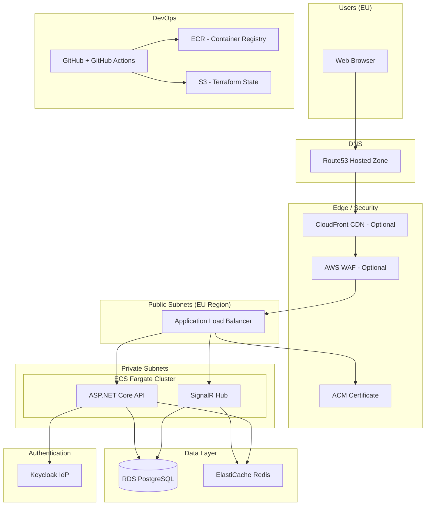
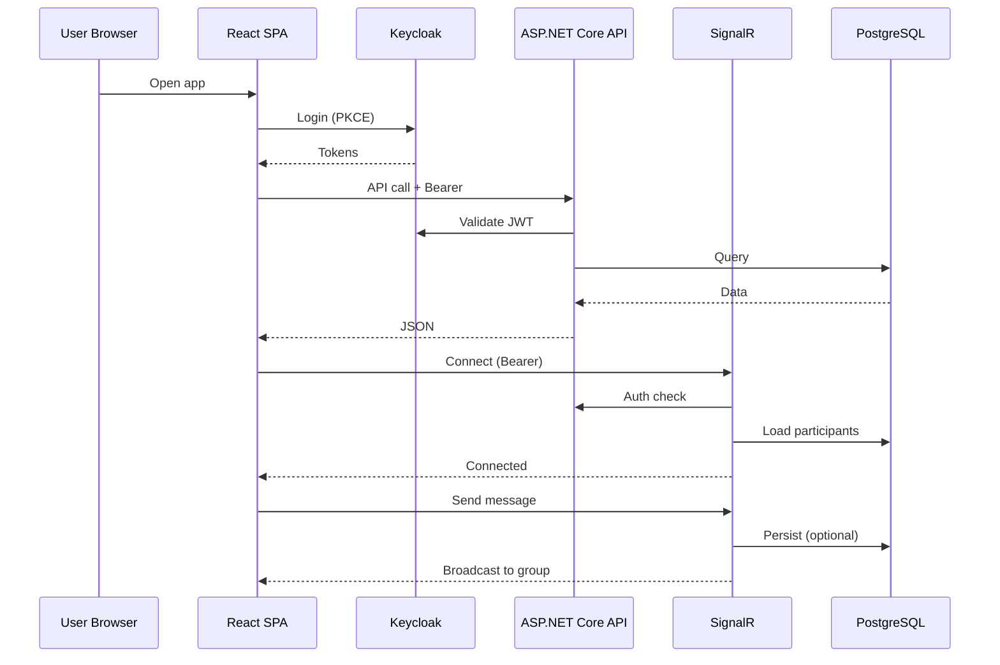

# BoardGamer — Technical Architecture Plan

**Version:** 1.0  
**Date:** March 2025  
**Status:** Draft for implementation

---

## 1. Executive Summary

BoardGamer is a GDPR-compliant Single Page Application (SPA) for discovering and organizing in-person board game events. This document defines the technical architecture using **ASP.NET Core** (backend), **PostgreSQL** (database), **React** (frontend), **Keycloak** (authentication), with deployment to **AWS** via **Terraform** and **GitHub Actions**, and source code hosted on **GitHub**.

---

## 2. Architecture Principles

| Principle | Application |
|-----------|-------------|
| **EU-first** | Primary region EU; data residency and GDPR by design |
| **Security by default** | HTTPS only, Keycloak SSO, minimal PII, encrypted secrets |
| **Scalability** | Stateless API, horizontal scaling, async where needed |
| **Observability** | Structured logging, metrics, health checks |
| **Infrastructure as Code** | Terraform for AWS; GitHub Actions for CI/CD |

---

## 3. High-Level System Architecture

### 3.1 Logical View

```
┌─────────────────────────────────────────────────────────────────────────────┐
│                              CLIENT LAYER                                    │
│  ┌─────────────────────────────────────────────────────────────────────┐   │
│  │  React SPA (TypeScript)                                               │   │
│  │  • React Router • Keycloak JS adapter • Real-time (WebSocket client)   │   │
│  └─────────────────────────────────────────────────────────────────────┘   │
└─────────────────────────────────────────────────────────────────────────────┘
                                        │
                    HTTPS (API)          │          WSS (chat)
                    + OIDC tokens        │
                                        ▼
┌─────────────────────────────────────────────────────────────────────────────┐
│                              GATEWAY / EDGE                                   │
│  AWS ALB → (optional) API Gateway / WAF                                       │
└─────────────────────────────────────────────────────────────────────────────┘
                                        │
                                        ▼
┌─────────────────────────────────────────────────────────────────────────────┐
│                              APPLICATION LAYER                                │
│  ┌──────────────────────┐  ┌──────────────────────┐  ┌──────────────────┐   │
│  │  ASP.NET Core API    │  │  SignalR Hub          │  │  Keycloak         │   │
│  │  (REST + validation) │  │  (event chat)         │  │  (Auth IdP)       │   │
│  └──────────────────────┘  └──────────────────────┘  └──────────────────┘   │
└─────────────────────────────────────────────────────────────────────────────┘
                                        │
                                        ▼
┌─────────────────────────────────────────────────────────────────────────────┐
│                              DATA LAYER                                       │
│  PostgreSQL (RDS)  •  Redis (ElastiCache, optional for SignalR backplane)    │
└─────────────────────────────────────────────────────────────────────────────┘
```

### 3.2 Infrastructure Diagram (AWS)

See [Section 10](#10-infrastructure-diagram) for the full Mermaid diagram. Mermaid source and additional diagrams (network, CI/CD, auth flow): [diagrams/infrastructure-diagram.md](diagrams/infrastructure-diagram.md).

---

## 4. Technology Stack

| Layer | Technology | Rationale |
|-------|------------|-----------|
| **Frontend** | React 18+ (TypeScript) | SPA, strong typing, ecosystem; aligns with PRD |
| **Backend API** | ASP.NET Core 8 | REST API, middleware, integration with Keycloak and SignalR |
| **Real-time** | ASP.NET Core SignalR | Event-scoped chat; scales with Redis backplane |
| **Database** | PostgreSQL 15+ | Relational model, JSON support, EU RDS availability |
| **Auth** | Keycloak | OIDC/OAuth2, user federation, GDPR-friendly (user export/delete) |
| **Hosting** | AWS | ECS/Fargate or EC2, RDS, ALB, S3, Route53 |
| **IaC** | Terraform | Reproducible AWS environments |
| **CI/CD** | GitHub Actions | Build, test, deploy from GitHub |
| **Secrets** | AWS Secrets Manager / SSM | No secrets in code or Terraform state |

---

## 5. Backend Architecture (ASP.NET Core)

### 5.1 Solution Structure

```
src/
  BoardGamer.Api/                 # Web API project
    Controllers/
    Middleware/
    Program.cs
  BoardGamer.Application/         # Use cases, DTOs, interfaces
    Events/
    Users/
    Reviews/
    Chat/
    Common/
  BoardGamer.Domain/             # Entities, value objects, domain events
    Entities/
    ValueObjects/
  BoardGamer.Infrastructure/      # EF Core, Keycloak, SignalR, external
    Persistence/
    Identity/
    SignalR/
  BoardGamer.Contracts/          # API request/response DTOs (shared)
```

### 5.2 API Design

- **REST** for resources: `GET/POST/PUT/DELETE` on `/api/events`, `/api/users`, `/api/reviews`, etc.
- **Versioning:** URL path versioning, e.g. `/api/v1/events`.
- **Auth:** Bearer JWT from Keycloak; validated via `Microsoft.AspNetCore.Authentication.JwtBearer` with Keycloak issuer/audience.
- **Authorization:** Role-based (Guest, User, Host, Admin) using Keycloak roles; policy-based checks in controllers/services.

**Key endpoints (v1):**

| Area | Method | Endpoint | Description |
|------|--------|----------|-------------|
| Events | GET | `/api/v1/events` | Search events (query params: location, game, date, radius, hostRating, etc.) |
| Events | GET | `/api/v1/events/{id}` | Event details |
| Events | POST | `/api/v1/events` | Create event (auth) |
| Events | PUT | `/api/v1/events/{id}` | Update event (owner/admin) |
| Events | DELETE | `/api/v1/events/{id}` | Delete event (owner/admin) |
| Join | POST | `/api/v1/events/{id}/join-requests` | Request to join |
| Join | POST | `/api/v1/events/{id}/join-requests/{requestId}/approve` | Approve (host) |
| Join | POST | `/api/v1/events/{id}/join-requests/{requestId}/reject` | Reject (host) |
| Users | GET | `/api/v1/users/me` | Current user profile |
| Users | GET | `/api/v1/users/{id}` | Public profile (ratings, bio, stats) |
| Users | PUT | `/api/v1/users/me` | Update profile |
| Reviews | GET | `/api/v1/users/{id}/reviews` | Reviews for user |
| Reviews | POST | `/api/v1/events/{id}/reviews` | Submit review (post-event) |
| GDPR | GET | `/api/v1/users/me/export` | Export my data |
| GDPR | DELETE | `/api/v1/users/me` | Delete account (with confirmation) |
| Admin | * | `/api/v1/admin/*` | Admin-only routes |

### 5.3 Authentication & Authorization (Keycloak)

- **Flow:** Authorization Code + PKCE for the SPA; backend validates JWT.
- **Keycloak realm:** One realm for BoardGamer (e.g. `boardgamer`).
- **Clients:**
  - **SPA (public):** Confidential or public client with PKCE; redirect URIs restricted to app origins.
  - **Backend:** No client credentials needed for user requests; optional service account only for admin/sync if required.
- **Roles:** `guest` (anonymous), `user`, `host` (can be derived from “created events” or explicit role), `admin`.
- **User attributes:** Store in Keycloak: `email`, `username`, `preferred_username`. Optional: profile attributes; alternatively keep profile in PostgreSQL and link by `sub` (subject ID).
- **Token validation:** Validate `iss`, `aud`, signature, and `exp`; map `realm_access.roles` or `resource_access` to app roles.

### 5.4 Real-Time Chat (SignalR)

- **Hub:** e.g. `EventChatHub`; group name = `event_{eventId}` (only participants join).
- **Authorization:** On connection, verify user is participant of `eventId` (DB or cache); reject if not.
- **Messages:** Send to group; persist to PostgreSQL (optional) for moderation/audit; deliver via SignalR.
- **Scaling:** Use Redis backplane so multiple API instances share SignalR groups (Redis on ElastiCache).
- **Frontend:** `@microsoft/signalr` in React; connect with Bearer token.

---

## 6. Data Architecture (PostgreSQL)

### 6.1 Core Entities (Conceptual)

- **Users (local profile):** `Id` (UUID), `KeycloakSubjectId` (from Keycloak `sub`), `Username`, `Bio`, `CreatedAt`, `UpdatedAt`. Host/player ratings derived from reviews; event counts from aggregates.
- **Events:** `Id`, `Title`, `HostUserId`, `Location` (address + lat/long for radius search), `StartsAt`, `EndsAt`, `MinPlayers`, `MaxPlayers`, `Description`, `Status`, `CreatedAt`, `UpdatedAt`.
- **EventGames:** Many-to-many; `EventId`, `BoardGameId` (or `GameName` if no games DB).
- **BoardGames:** `Id`, `Name`, (optional: BGG id, thumbnail).
- **JoinRequests:** `Id`, `EventId`, `UserId`, `Status` (Pending/Approved/Rejected), `RequestedAt`, `RespondedAt`, `RespondedByUserId`.
- **EventParticipants:** `EventId`, `UserId`, `Role` (Host/Player), `JoinedAt` (from approved join request).
- **Reviews:** `Id`, `EventId`, `ReviewerUserId`, `TargetUserId`, `RatingType` (Host/Player), `Rating` (1–5), `Comment`, `CreatedAt`.
- **ChatMessages (optional):** `Id`, `EventId`, `UserId`, `Content`, `CreatedAt` (if persisting).
- **CookieConsent / Audit:** For GDPR; store consent type and timestamp per user.

### 6.2 Key Design Decisions

- **Identity link:** User table keyed by Keycloak `sub`; no password in app DB.
- **Search:** Event search by location (PostGIS or lat/long + distance), game, date range, host rating (computed or cached). Use indexes on `StartsAt`, `HostUserId`, and spatial index if using PostGIS.
- **Ratings:** Store individual reviews; compute average host/player rating and review count in queries or via materialized view/cache for list views.

---

## 7. Frontend Architecture (React)

### 7.1 Stack

- **React 18**, **TypeScript**, **Vite** (build).
- **Routing:** React Router v6.
- **Auth:** `keycloak-js` or `@react-keycloak/web`; secure route wrapper; token in memory + refresh.
- **HTTP:** Axios or fetch with interceptors to attach Bearer token and handle 401 (redirect to login).
- **State:** React Query (TanStack Query) for server state; Context or Zustand for minimal client state (e.g. theme, cookie consent).
- **UI:** Component library (e.g. MUI, Chakra, or custom) with WCAG-oriented markup.
- **Real-time:** `@microsoft/signalr` for event chat.

### 7.2 Key Pages (from PRD)

- Home, Register, Login, Search Events, Event Details, Create Event, My Events, Profile, Admin Panel.
- Cookie consent banner (store preference; send to backend if needed for audit).
- Privacy policy and cookie policy pages; consent check before registration.

### 7.3 Security (Frontend)

- No long-lived secrets; PKCE + token in memory.
- All API calls over HTTPS with Bearer token.
- Sanitize user-generated content to prevent XSS; CSP headers from backend.

---

## 8. GDPR & Compliance

- **Privacy policy:** Dedicated page; link at registration and in footer.
- **Cookie consent:** Banner with Accept/Reject; store in backend and/or localStorage; only non-essential cookies if rejected.
- **Data export:** `GET /api/v1/users/me/export` returns structured JSON (profile, events, reviews) for the authenticated user.
- **Right to erasure:** `DELETE /api/v1/users/me`; anonymize or delete user record and related PII; optionally notify Keycloak admin API to remove or anonymize user in Keycloak.
- **Minimal data:** Store only what’s necessary; document in privacy policy.
- **HTTPS only:** Enforced at ALB and in app.

---

## 9. Deployment & Infrastructure (AWS + Terraform + GitHub Actions)

### 9.1 Repository Layout (GitHub)

```
BoardGamer/
  .github/
    workflows/
      backend-ci.yml      # Build/test .NET
      frontend-ci.yml     # Build/test React
      deploy.yml         # Terraform apply (or separate tf apply workflow)
  src/
    backend/             # ASP.NET Core solution
    frontend/            # React app
  infra/
    terraform/
      modules/
        network/
        compute/
        database/
        auth/             # Keycloak on ECS or external
      environments/
        dev/
        staging/
        prod/
      main.tf
      variables.tf
      outputs.tf
  docs/
```

### 9.2 AWS Services (Terraform-managed)

- **Compute:** ECS Fargate (API + SignalR in same service or separate) or EC2 + containers.
- **Load balancing:** Application Load Balancer (ALB); HTTPS listener; optional WAF.
- **Database:** RDS PostgreSQL (Multi-AZ for prod); private subnets; no public access.
- **Cache (optional):** ElastiCache Redis for SignalR backplane and/or response cache.
- **Secrets:** Secrets Manager for DB password, Keycloak client secret; SSM for non-sensitive config.
- **Storage:** S3 for static assets (e.g. React build) if using S3 + CloudFront; otherwise serve SPA from same origin or ALB.
- **DNS:** Route53 hosted zone; ALB alias record.
- **Keycloak:** Option A — Keycloak on ECS (Fargate) + RDS or Option B — Managed Keycloak (e.g. Keycloak on same ECS cluster with dedicated DB). Document chosen option in infra README.

### 9.3 Terraform Strategy

- **State:** Remote state in S3 + DynamoDB lock (backend block).
- **Environments:** Separate state per environment (dev/staging/prod); parameterized via workspace or directories.
- **Modules:** Reusable modules for VPC, ECS, RDS, ALB, so that prod can mirror dev with different sizing.

### 9.4 GitHub Actions

- **CI (on PR / push):**
  - Backend: checkout → setup .NET → restore → build → test (e.g. xUnit).
  - Frontend: checkout → setup Node → install → lint → build → test.
- **CD (on merge to main or tag):**
  - Build and push Docker image(s) to ECR.
  - Run `terraform plan` (and optionally `apply` for dev); for prod, manual approval then `terraform apply`.
  - Update ECS service with new image (or use Terraform to point to new image tag).

### 9.5 Region & Data Residency

- Deploy all workloads and data (RDS, S3, ECS) in **eu-west-1** (or chosen EU region) to satisfy EU-first and GDPR expectations.

---

## 10. Infrastructure Diagram

### 10.1 Mermaid Diagram (AWS)



### 10.2 Component Interaction (High-Level)



---

## 11. Security Summary

- **Authentication:** Keycloak (OIDC); JWT validation on every API and SignalR connection.
- **Authorization:** Roles (user, host, admin); resource-level checks (e.g. event owner) in API.
- **Transport:** HTTPS only; TLS 1.2+ at ALB and app.
- **Data:** Passwords only in Keycloak; DB credentials in Secrets Manager; no secrets in repo.
- **Input:** Validation and parameterization to prevent SQL injection and XSS; CSP and security headers from API.
- **GDPR:** Export and delete endpoints; cookie consent; minimal PII; documented in privacy policy.

---

## 12. Non-Functional Requirements Mapping

| NFR | Approach |
|-----|----------|
| Page load < 2 s | CDN for static assets; lazy loading; optimized bundles |
| Search < 1 s | Indexed queries; optional Redis cache for hot searches |
| Thousands of users | Stateless API; horizontal scaling (ECS); connection pooling (Npgsql); Redis for SignalR |
| WCAG | Semantic HTML; ARIA where needed; keyboard nav; contrast; tested with axe or similar |

---

## 13. Implementation Phases (Alignment with PRD Milestones)

| Phase | Focus | Deliverables |
|-------|--------|---------------|
| **1 – Foundation** | Repo, IaC, auth, DB schema | GitHub repo; Terraform (VPC, RDS, ECS skeleton); Keycloak realm; ASP.NET Core + React shells; basic login |
| **2 – MVP** | Events, search, join, profiles | Event CRUD; search API; join requests; user profile API; React pages (Home, Search, Event detail, Create, My Events) |
| **3 – Social** | Chat, reviews | SignalR chat; review/rating API and UI |
| **4 – Admin** | Moderation | Admin API and panel; event/review moderation |
| **5 – Compliance** | GDPR, cookies | Export/delete; cookie banner; privacy/cookie pages |
| **6 – Launch** | Test, harden, deploy | Security/perf tests; prod Terraform; GitHub Actions CD; go-live |

---

## 14. Document History

| Version | Date | Author | Changes |
|---------|------|--------|---------|
| 1.0 | 2025-03 | — | Initial technical architecture |

---

*This document is the single source of truth for the technical architecture of BoardGamer and should be updated when significant design decisions change.*
