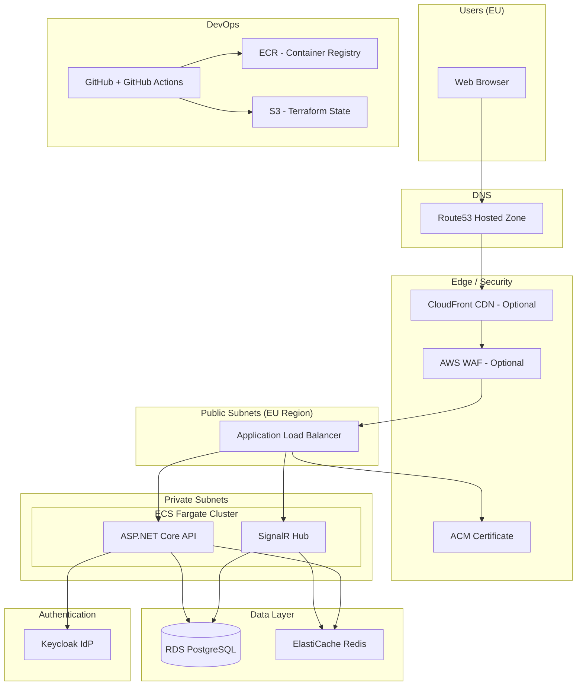
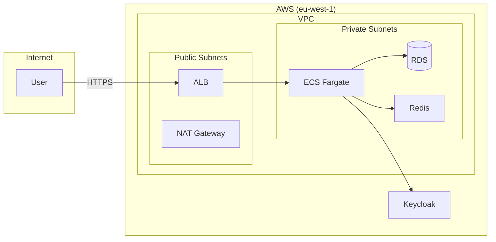
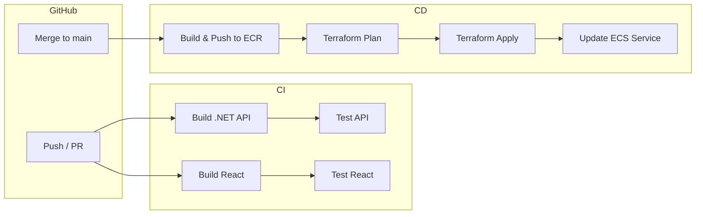
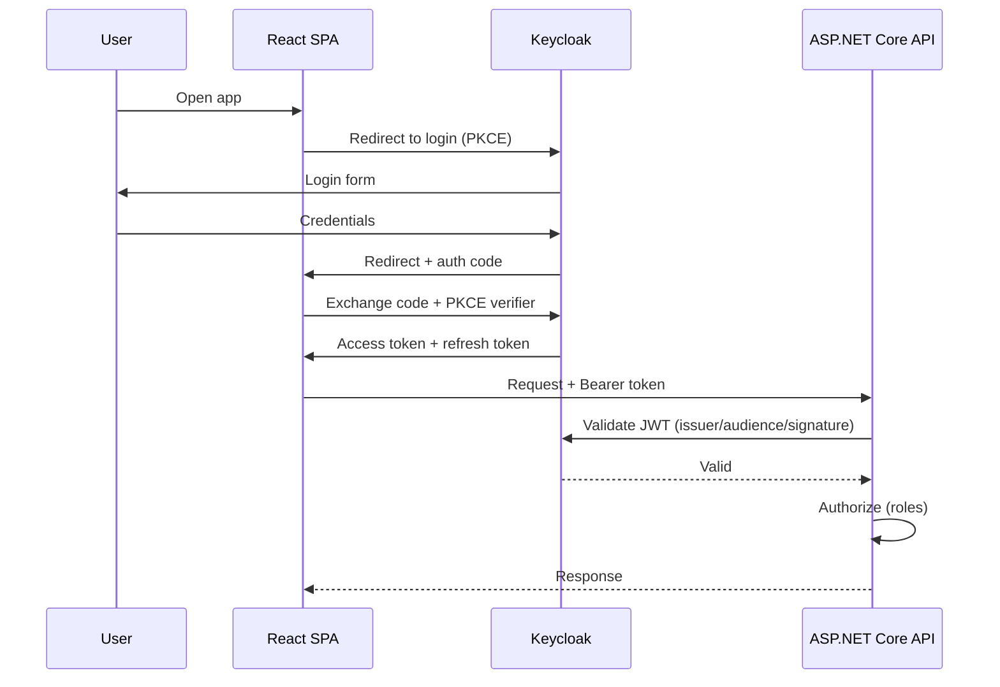

# BoardGamer — AWS Infrastructure Diagram

This file contains Mermaid diagrams for infrastructure and deployment. Render in GitHub, VS Code (Mermaid extension), or [mermaid.live](https://mermaid.live).

---

## AWS Infrastructure Overview

---

## Simplified Network Topology

---

## CI/CD Pipeline (GitHub Actions)

---

## Authentication Flow (Keycloak + SPA + API)

